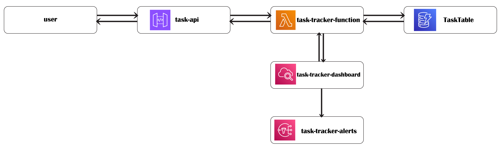
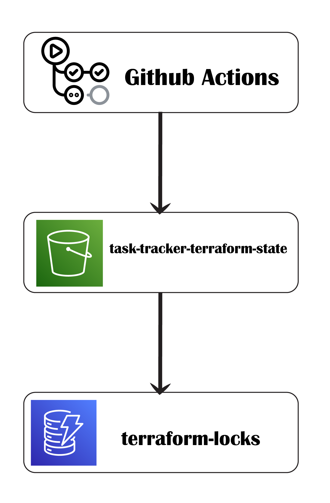

# Task Tracker Web Service

A fully serverless task tracking API built using **AWS Lambda**, **API Gateway**, and **DynamoDB** — all provisioned with **Terraform** and continuously deployed via **GitHub Actions**. Includes real-time monitoring with **CloudWatch Dashboards**, **Alarms**, and **SNS Email Alerts**.


## 📑 Table of Contents

- [Project Scope](#project-scope)
- [Architecture Overview](#architecture-overview)
- [Folder Structure](#folder-structure)
- [Step-by-Step Implementation Process](#step-by-step-implementation-process)
  - [Step 1: Prepare the Lambda Function](#step-1-prepare-the-lambda-function)
  - [Step 2: Setup Infrastructure using Terraform](#step-2-setup-infrastructure-using-terraform)
  - [Step 3: Add S3 Backend for Terraform State](#step-3-add-s3-backend-for-terraform-state)
  - [Step 4: Monitoring with CloudWatch](#step-4-monitoring-with-cloudwatch)
  - [Step 5: Alarms and Email Notifications](#step-5-alarms-and-email-notifications)
  - [Step 6: Set Up CI/CD with GitHub Actions](#step-6-set-up-cicd-with-github-actions)
  - [Step 7: Final Deployment](#step-7-final-deployment)
- [Monitoring & Alerts](#monitoring--alerts)
- [Security Highlights](#security-highlights)
- [Deployment Process (Manual + CI/CD)](#deployment-process-manual--cicd)
- [Troubleshooting](#troubleshooting)
- [Final Notes](#final-notes)
- [Author](#author)
- [Useful Links](#useful-links))


## Project Scope

Build a simple **Task Tracker** web service with the following goals:

- Support full CRUD operations (Create, Read, Update, Delete)
- Hosted on **AWS Lambda** (serverless)
- Use **API Gateway** as the HTTP interface
- Store data in **DynamoDB**
- Manage infrastructure using **Terraform**
- Automate deployment with **GitHub Actions**
- Implement **CloudWatch** for monitoring and alerting
- Ensure security via **IAM Roles** and **Secrets**

---

## Architecture Overview



---

## Folder Structure

```
.
├── AWS_Lambda/
│   ├── handler.py          # Python Lambda handler
│   └── python/             # Dependencies installed by pip
│
├── bootstrap/
│   ├── backend_setup.tf    # S3 + DynamoDB for state + locks
│   └── terraform.tfstate   # Local state after bootstrap
│
├── terraform/
│   ├── main.tf             # Infrastructure config
│   ├── variables.tf        # Terraform input variables
│   ├── outputs.tf          # Outputs like API URL
│   ├── cloudwatch.tf       # CloudWatch dashboard
│   ├── cloudwatch_alarms.tf# CloudWatch alarms + SNS
│   ├── terraform.tfstate
│   └── terraform.tfstate.backup
│
├── function.zip            # Zipped Lambda code (auto-generated)
├── requirements.txt        # Python dependencies (boto3)
└── .github/workflows/
    └── deploy.yml          # CI/CD pipeline config
```

---

## Step-by-Step Implementation Process

### Step 1: Prepare the Lambda Function

Lambda is a **serverless compute service** that runs Python functions triggered by API Gateway. The file is named `handler.py` because Terraform uses the format `filename.function`, and here it’s `handler.lambda_handler`.

### What it does:
- Implements **CRUD endpoints** (`POST`, `GET`, `PUT`, `DELETE`)
- Reads environment variable `TASKS_TABLE_NAME` (injected by Terraform)
- Uses **boto3** to access DynamoDB

The environment variable is passed securely from Terraform.

NOTE: To test alarms via CloudWatch, skip to **Step 5**.

---

### Step 2: Setup Infrastructure using Terraform

- AWS provider configured for **`eu-west-3`**
- IAM Role and Policy created with **least privilege**
- DynamoDB table **`TaskTable`**
- Lambda function (Python 3.12) configured with zipped handler
- API Gateway connected via `$default` route
- Gave API Gateway permission to invoke Lambda

Also:
- `variables.tf`: holds `aws_region`, `lambda_function_name`, `dynamodb_table_name`, and `alert_email`
- `outputs.tf`: exports the **API Gateway endpoint**, Lambda name, and table name

---

### Step 3: Add S3 Backend for Terraform State

- Created S3 bucket `task-tracker-terraform-state`
- Created DynamoDB table `terraform-locks` for state locking
- Added this backend block in `main.tf`:

```hcl
terraform {
  backend "s3" {
    bucket         = "task-tracker-terraform-state"
    key            = "infra/terraform.tfstate"
    region         = "eu-west-3"
    dynamodb_table = "terraform-locks"
    encrypt        = true
  }
}
```

**Why this matters**:
Without this, you’ll get:
- `state file is already locked` errors
- inconsistency in deployments
- broken CI/CD for team collaboration

With remote state, Terraform operations are safe and collaborative.

---

### Step 4: Monitoring with CloudWatch

Created dashboard `task-tracker-dashboard` with these widgets:

- **Invocations & Errors**: track service usage and failures
- **Lambda Duration**: monitor execution time
- **Throttles & Concurrent Executions**: detect overloads

These metrics were chosen for:
- **Functionality**
- **Performance**
- **Scalability**

---

### Step 5: Alarms and Email Notifications

- Created SNS topic `task-tracker-alerts`
- Subscribed an email via GitHub Secret `ALERT_EMAIL`

#### Alarms Created:
- `LambdaErrorAlarm`: fires when `Errors > 0`
- `LambdaDurationAlarm`: fires when `Duration > 1000ms`

These match the CloudWatch metrics from Step 4.

To test errors:
In commit `fa80cb1`, this route was added to `handler.py`:

```python
if path == "/trigger-error":
    raise Exception("This is a forced error")
```

 Sending a request to `/trigger-error` via Postman triggers the alarm.

 **How the email alert works**:
- `alert_email` is passed as a Terraform variable
- It is injected from GitHub Secrets using:

```yaml
- name: Terraform Init & Apply
  run: terraform apply -var="alert_email=${{ secrets.ALERT_EMAIL }}"
```

---

### Step 6: Set Up CI/CD with GitHub Actions




- Triggered on `push` to `main`
- Installs Python 3.12
- Installs dependencies
- Zips the Lambda
- Runs Terraform to deploy infrastructure

```yaml
- name: Terraform Init & Apply
  run: |
    cd terraform
    terraform init
    terraform apply -auto-approve -var="alert_email=${{ secrets.ALERT_EMAIL }}"
```

Ensures code and infra are always in sync.

---

### Step 7: Final Deployment

- Final handler.py is clean, with optional error route commented or explained
- CloudWatch dashboard renders with real metrics
- Email alerts are confirmed to work

To test alarms:
- Use commit `fa80cb1` for `/trigger-error`
- Revert to latest commit for production

---

## Monitoring & Alerts

| Component     | Description                                                   |
|---------------|---------------------------------------------------------------|
| Logs          | `/aws/lambda/task-tracker-function` (CloudWatch Logs)         |
| Dashboard     | `task-tracker-dashboard` with widgets for Errors, Duration    |
| Alarms        | `LambdaErrorAlarm` & `LambdaDurationAlarm` → send email alerts|

Status `OK`: system is healthy  
Status `ALARM`: errors occurred or response time too high

---

## Security Highlights

- IAM roles use **least privilege**
- Email alert is passed securely using GitHub Secrets (`ALERT_EMAIL`)
- Terraform remote state is stored in encrypted **S3** with locking via **DynamoDB**

Everything follows IaC and AWS security best practices.

---

## Deployment Process (Manual + CI/CD)

| Step | Action |
|------|--------|
| 1️⃣  | `cd bootstrap/ && terraform init && terraform apply` → sets up backend |
| 2️⃣  | Push code to `main` branch |
| 3️⃣  | GitHub Actions deploys infra and code |
| 4️⃣  | Copy API URL from output and test with Postman |

 **Manual + CI/CD hybrid** is the recommended approach for Terraform:
- Manual: backend bootstrap (done once)
- CI/CD: all future infra/code changes

---

## Troubleshooting

| Symptom              | Cause                        | Solution                          |
|----------------------|------------------------------|-----------------------------------|
| `state lock error`   | Backend not initialized      | Run `terraform init` in bootstrap |
| Alarms not triggering| Email not confirmed          | Confirm SNS subscription email    |
| No Lambda update     | `function.zip` not rebuilt   | Ensure zip is regenerated in CI   |
| 404 on POSTMAN       | Wrong route or method        | Double-check API path/method      |

---

## Final Notes

- Fully serverless and scalable architecture
- Uses Terraform and GitHub Actions professionally
- Monitoring, alerting, and security are in place
- Easily extendable to real-world production systems

---

## Author

**Rey Sylaj**

---

## Useful Links

- [AWS Lambda](https://docs.aws.amazon.com/lambda)
- [DynamoDB](https://docs.aws.amazon.com/amazondynamodb)
- [API Gateway](https://docs.aws.amazon.com/apigateway)
- [Terraform AWS](https://registry.terraform.io/providers/hashicorp/aws/latest/docs)
- [GitHub Actions](https://docs.github.com/actions)
- [Boto3 Docs](https://boto3.amazonaws.com)
